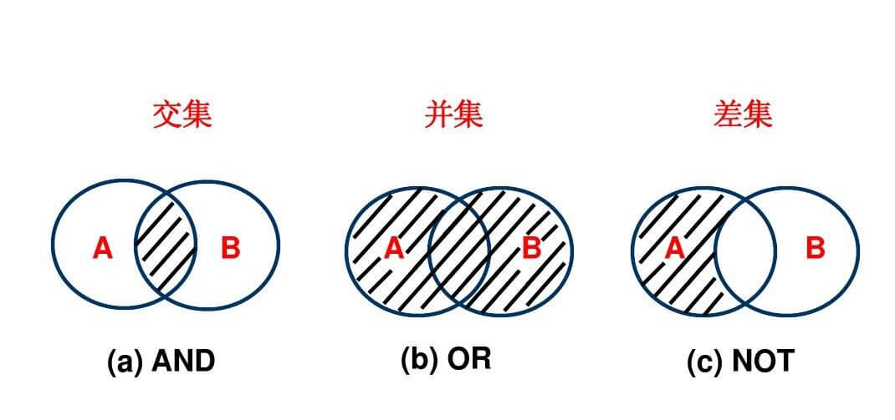

# 对象的交集、并集和差集

## 交集、并集、差集

- 交集：对于两个给定集合 A、B，由属于 A 又属于 B 的所有元素构成的集合，叫做 A 和 B 的交集。A={1,2,3,4,5}，B={3,4,5,6,8}，A∩B={3,4,5}
- 并集：对于两个给定集合 A、B，由两个集合所有元素构成的集合，叫做 A 和 B 的并集。例： {3,5}U{2,3,4,6}= {2,3,4,5,6}
- 差集：记 A，B 是两个集合，则所有属于 A 且不属于 B 的元素构成的集合，叫做集合 A 减集合 B(或集合 A 与集合 B 之差)，类似地，对于集合 A、B，把集合{x∣x∈A,且 x∉B}叫做 A 与 B 的差集。



## 普通数组的交集、并集和差集

> 定义数组成员为非引用类型的数组称为普通数组

```js
var a = [1, 2, 3];
var b = [2, 4, 5];
```

```js
// 交集
let intersection = a.filter(v => b.includes(v));
// [2]
```

```js
// 差集
let diff = a.concat(b).filter(v => a.includes(v) && !b.includes(v));
// [1, 3]
```

```js
// 并集
let union = a.concat(b.filter(v => !a.includes(v)));
// [1, 2, 3, 4, 5]
```

## 数组对象的交集、并集、差集

> 定义数组成员为引用类型的数组称为数组对象

```js
var a = [
  { code: 1, value: "a1" },
  { code: 2, value: "a2" },
  { code: 3, value: "a3" }
];
var b = [
  { code: 1, value: "b1" },
  { code: 2, value: "b2" },
  { code: 4, value: "b3" }
];
```

```js
// some，遍历数组中所有元素满足return条件，如果满足，返回满足前的，包含满足的
// a与b的交集
let intersection = a.filter(x => b.some(y => x.code === y.code));
// [{ code: 1, value: "a1" }, { code: 2, value: "a2" }];
```

```js
// every，测试数组中所有元素满足return条件，如果不满足，返回不满足的前的，包含不满足的
// a对b的差集
let diff = a.filter(x => b.every(y => x.code !== y.code));
//  [{code: 3, value: "b3"}]
```

```js
// b与a的并集，b与a有相同的code，用b覆盖a的，同时添上a没有b的成员
let diff = b.filter(x => a.every(y => x.code !== y.code));
let temp = a;
for (var i = 0; i < a.length; i++) {
  for (var j = 0; j < b.length; j++) {
    if (a[i].code === b[i].code) {
      temp[i] = b[i];
    }
  }
}
let union = temp.concat(diff);
// [
//   { code: 1, value: "b1" },
//   { code: 2, value: "b2" },
//   { code: 3, value: "a3" },
//   { code: 4, value: "b3" }
// ];
```
