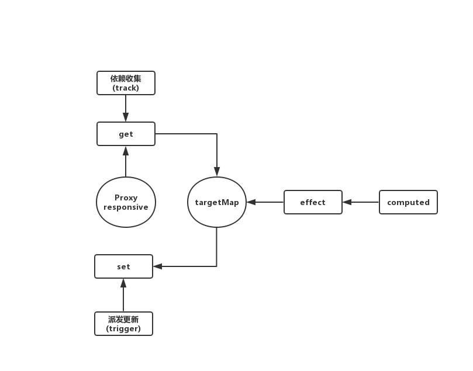

# vue3 的数据响应原理和实现

## 实现步骤

### 一、responsive 的实现

```js
var isObject = object => (object && typeof object === "object" ? true : false);
var func = {
  get(target, key, receiver) {
    var result = Reflect.get(target, key, receiver);
    return isObject(result) ? responsive(result) : result;
  },
  set(target, key, val, receiver) {
    return Reflect.set(target, key, val, receiver);
  }
};
var wm1 = new WeakMap();
var wm2 = new WeakMap();
var responsive = function(target) {
  // 是否有observed
  var observed = wm1.get(target);
  // 是否有target
  var value = wm2.has(target);
  if (observed) {
    return observed;
  }
  if (value) {
    return target;
  }
  observed = new Proxy(target, func);
  // 缓存observed
  wm1.set(target, observed);
  // 缓存target
  wm2.set(observed, target);
  return observed;
};
var person = {
  name: "小何",
  weight: 74,
  girls: {
    1: "小尹",
    2: "小钱"
  }
};
var r1 = responsive(person);
r1 = responsive(person);
r1 = responsive(r1);
console.log(r1.weight); // 74
r1.weight = 75;
console.log(r1.weight); // 75
```

### 二、effect 的实现

```js
// effect的实现
function effect(fn, options = {}) {
  var effect = createResponsiveEffect(fn, options);
  return options.lazy ? effect : effect();
}
function createResponsiveEffect(fn, options) {
  var effect = function(...args) {
    return run(effect, fn, args);
  };
  effect.lazy = options.lazy;
  effect.computed = options.computed;
  effect.deps = [];
  return effect;
}
```

### 三、responsive 与 effect 的结合

- run 的实现

```js
var activeEffectStack = [];
function run(effect, fn, args) {
  if (activeEffectStack.indexOf(effect) === -1) {
    try {
      // 把effectpush到数组里面
      activeEffectStack.push(effect);
      return fn(...args);
    } finally {
      // 清除已经收集到的effect
      activeEffectStack.pop();
    }
  }
}
```

- 触发依赖收集与派发更新

```js
var func = {
  get(target, key, receiver) {
    var result = Reflect.get(target, key, receiver);
    // 依赖收集
    track(target, key);
    return isObject(result) ? responsive(result) : result;
  },
  set(target, key, val, receiver) {
    var result = Reflect.set(target, key, val, receiver);
    const extra = { oldValue: target[key], newValue: target };
    // 派发更新
    trigger(target, key, extra);
    return result;
  }
};
```

- 依赖收集的实现

```js
// 依赖收集的最终数据结构
// targetMap = {
//   target: {
//     name: [effect]，
//     height: [effect]
//   }
// }
var targetMap = new WeakMap();
function track(target, key) {
  var effect = activeEffectStack(activeEffectStack.length - 1);
  if (effect) {
    var depsMap = targetMap.get(target);
    if (depsMap === void 0) {
      depsMap = new Map();
      targetMap.set(target, depsMap);
    }
    var dep = depsMap.get(key);
    if (dep === void 0) {
      dep = new Set();
      depsMap.set(key, dep);
    }
    if (!dep.has(effect)) {
      dep.add(effect);
      effect.deps.push(dep);
    }
  }
}
```

- 派发更新

```js
function trigger(target, key, extra) {
  var depsMap = targetMap.get(target);
  if (depsMap === void 0 || key === void 0) {
    return;
  }
  var effects = new Set();
  var computedEffects = new Set();
  let deps = depsMap.get(key);
  deps.forEach(effect => {
    if (effect.computed) {
      computedEffects.add(effect);
    } else {
      effects.add(effect);
    }
  });
  computedEffects.forEach(effect => {
    effect();
  });
  effects.forEach(effect => {
    effect();
  });
}
```

### 四、computed 的实现

```js
function computed(fn) {
  var getter = fn;
  var func = effect(getter, { computed: true, lazy: true });
  return {
    effect: func,
    get value() {
      return func();
    }
  };
}
```

## 完整代码

```html
<!DOCTYPE html>
<html lang="en">
  <head>
    <meta charset="UTF-8" />
    <meta name="viewport" content="width=device-width, initial-scale=1.0" />
    <meta http-equiv="X-UA-Compatible" content="ie=edge" />
    <title>vue3的响应式原理</title>
  </head>
  <script>
    // 提前定义的一些变量
    var isObject = object =>
      object && typeof object === "object" ? true : false;
    var wm1 = new WeakMap();
    var wm2 = new WeakMap();
    var activeEffectStack = [];
    var targetMap = new WeakMap();

    // 依赖收集
    function track(target, key) {
      var effect = activeEffectStack[activeEffectStack.length - 1];
      if (effect) {
        var depsMap = targetMap.get(target);
        if (depsMap === void 0) {
          depsMap = new Map();
          targetMap.set(target, depsMap);
        }
        var dep = depsMap.get(key);
        if (dep === void 0) {
          dep = new Set();
          depsMap.set(key, dep);
        }
        if (!dep.has(effect)) {
          dep.add(effect);
          effect.deps.push(dep);
        }
      }
    }
    // 派发更新
    function trigger(target, key, extra) {
      var depsMap = targetMap.get(target);
      if (depsMap === void 0 || key === void 0) {
        return;
      }
      var effects = new Set();
      var computedEffects = new Set();
      let deps = depsMap.get(key);
      deps.forEach(effect => {
        if (effect.computed) {
          computedEffects.add(effect);
        } else {
          effects.add(effect);
        }
      });
      computedEffects.forEach(effect => {
        effect();
      });
      effects.forEach(effect => {
        effect();
      });
    }
    // responsive
    var responsiveFunc = {
      get(target, key, receiver) {
        var result = Reflect.get(target, key, receiver);
        track(target, key);
        return isObject(result) ? responsive(result) : result;
      },
      set(target, key, val, receiver) {
        var result = Reflect.set(target, key, val, receiver);
        const extra = { oldValue: target[key], newValue: target };
        trigger(target, key, extra);
        return result;
      }
    };
    var responsive = function(target) {
      // 是否有observed
      var observed = wm1.get(target);
      // 是否有target
      var value = wm2.has(target);
      if (observed) {
        return observed;
      }
      if (value) {
        return target;
      }
      observed = new Proxy(target, responsiveFunc);
      // 缓存observed
      wm1.set(target, observed);
      // 缓存target
      wm2.set(observed, target);
      return observed;
    };

    // effect
    function effect(fn, options = {}) {
      var effect = createResponsiveEffect(fn, options);
      return options.lazy ? effect : effect();
    }
    function createResponsiveEffect(fn, options) {
      var effect = function(...args) {
        return run(effect, fn, args);
      };
      effect.lazy = options.lazy;
      effect.computed = options.computed;
      effect.deps = [];
      return effect;
    }
    // effect-responsive
    function run(effect, fn, args) {
      if (activeEffectStack.indexOf(effect) === -1) {
        try {
          // 把effectpush到数组里面
          activeEffectStack.push(effect);
          return fn(...args);
        } finally {
          // 清除已经收集到的effect
          activeEffectStack.pop();
        }
      }
    }

    // computed
    function computed(fn) {
      var getter = fn;
      var func = effect(getter, { computed: true, lazy: true });
      return {
        effect: func,
        get value() {
          return func();
        }
      };
    }
  </script>

  <body>
    <h3>
      体重指数 = 18.5 - 25 （中国体质标准:正常范围
      18.5~23.9，超重24.0~27.9，肥胖≥28.0）
    </h3>
    <p class="text" style="font-size: 30px;color:#e93030"></p>
    <button style="width: 100px;height: 50px;font-size: 30px;" class="button1">
      加1
    </button>
    <button style="width: 100px;height: 50px;font-size: 30px;" class="button2">
      减1
    </button>
    <script>
      const $text = document.querySelector(".text");
      const $button1 = document.querySelector(".button1");
      const $button2 = document.querySelector(".button2");
      var responsivePerson = responsive({
        name: "小何",
        height: 180,
        weight: 74,
        girls: {
          1: "小尹",
          2: "小钱"
        }
      });
      var calacBodyMass = computed(() => {
        return (
          responsivePerson.weight / Math.pow(responsivePerson.height / 100, 2)
        ).toFixed(1);
      });
      effect(() => {
        $text.innerHTML = `姓名：${responsivePerson.name}，身高：${responsivePerson.height}cm，体重：${responsivePerson.weight}kg，体重指数：${calacBodyMass.value}`;
      });
      $button1.onclick = () => {
        responsivePerson.height += 1;
      };
      $button2.onclick = () => {
        responsivePerson.height -= 1;
      };
    </script>
  </body>
</html>
```

## 流程图


git 地址：

## 其他

参考： https://blog.naice.me/article/5d9e9b8af37b6431e1bd36b8
